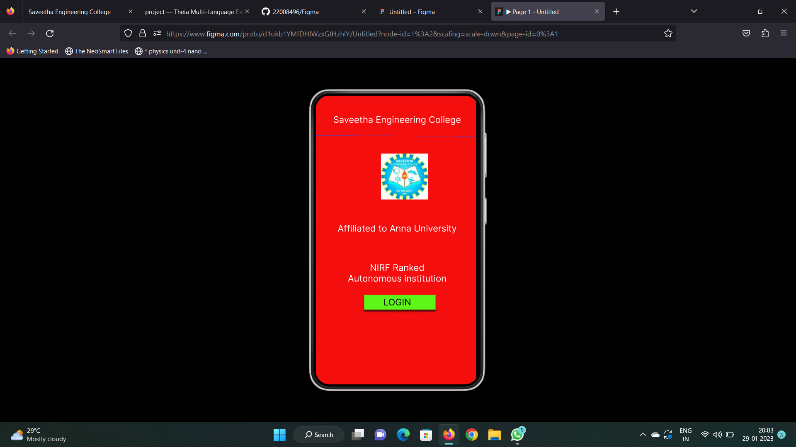
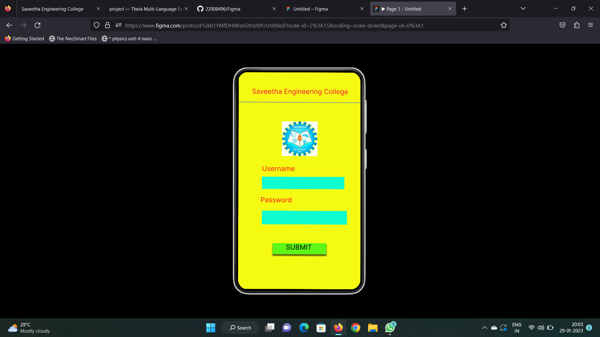
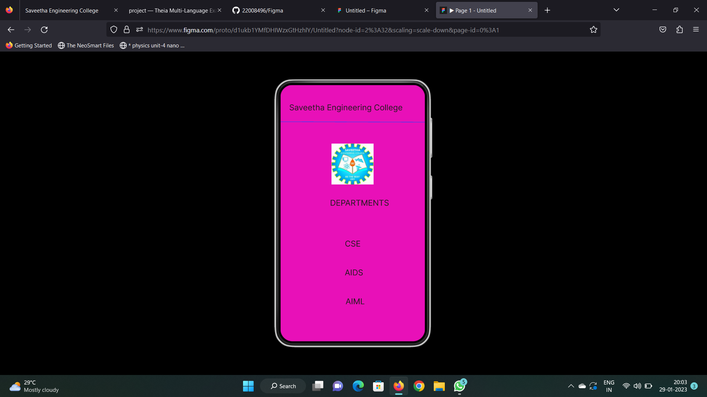

# Event Registration Web Application

## AIM:
To design, develop and deploy a web application for event registration.

## DESIGN STEPS:

### Step 1:
Create a new frame.

### Step 2:
Select any one preset size of your choice.

### Step 3:
Select the shapes you need.

### Step 4:
Import images as needed.

### Step 5:
Create pages based on your need and link them.

### Step 6:

Validate the HTML and CSS code.

### Step 6:

Publish the website in the given URL.

## DESIGN TOOL:
Figma

## code:
```
/* Home Page */
position: relative;
width: 355px;
height: 640px;
background: #F40E0E;

/* Login Page */
position: relative;
width: 375px;
height: 637.59px;
background: #F5FA13;

/* Saveetha Engineering College */
position: absolute;
width: 326px;
height: 38px;
left: 17px;
top: 41px;
font-family: 'Inter';
font-style: normal;
font-weight: 400;
font-size: 20px;
line-height: 24px;
text-align: center;
color: #FFFFFF;

/* DEPARTMENTS */
position: absolute;
width: 326px;
height: 38px;
left: 34px;
top: 282px;
font-family: 'Inter';
font-style: normal;
font-weight: 400;
font-size: 20px;
line-height: 24px;
text-align: center;
color: #201A1B;

/* AIML */
position: absolute;
width: 326px;
height: 38px;
left: 23px;
top: 528px;
font-family: 'Inter';
font-style: normal;
font-weight: 400;
font-size: 20px;
line-height: 24px;
text-align: center;
color: #201A1B;
 
 /* AIDS */
position: absolute;
width: 326px;
height: 38px;
left: 20px;
top: 456px;
font-family: 'Inter';
font-style: normal;
font-weight: 400;
font-size: 20px;
line-height: 24px;
text-align: center;
color: #201A1B;

/* CSE */
position: absolute;
width: 326px;
height: 38px;
left: 17px;
top: 384px;
font-family: 'Inter';
font-style: normal;
font-weight: 400;
font-size: 20px;
line-height: 24px;
text-align: center;
color: #201A1B;

/* Line 2 */
position: absolute;
width: 360px;
height: 0px;
left: 0px;
top: 92px;
border: 1px solid #194BFD;
transform: rotate(0.16deg);

/* logo 3 */
position: absolute;
width: 105px;
height: 102px;
left: 127px;
top: 146px;
background: url(logo.png);
```
## OUTPUT:




## RESULT:
The program to design, develop and deploy a web application for event registration is completed successfully.